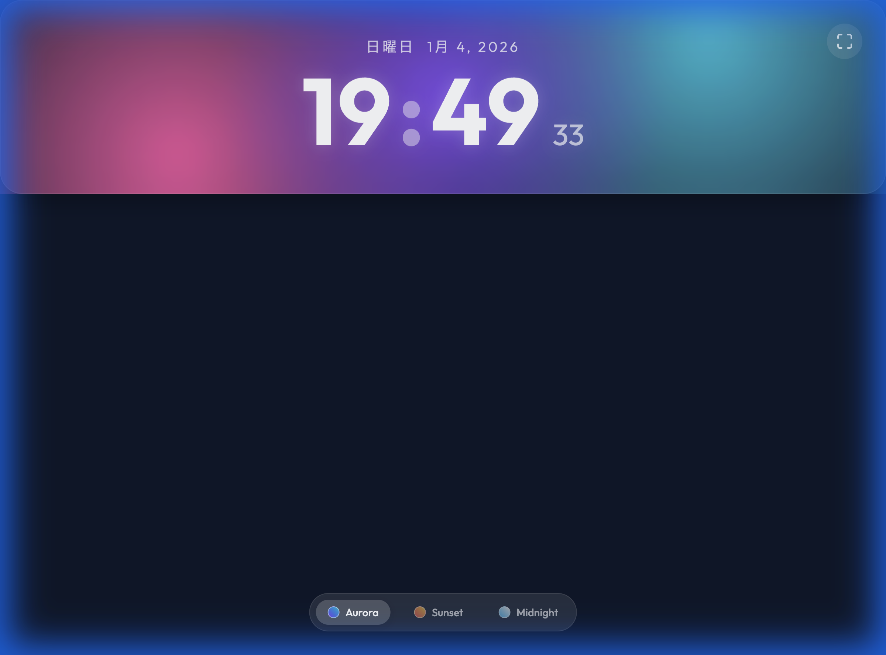
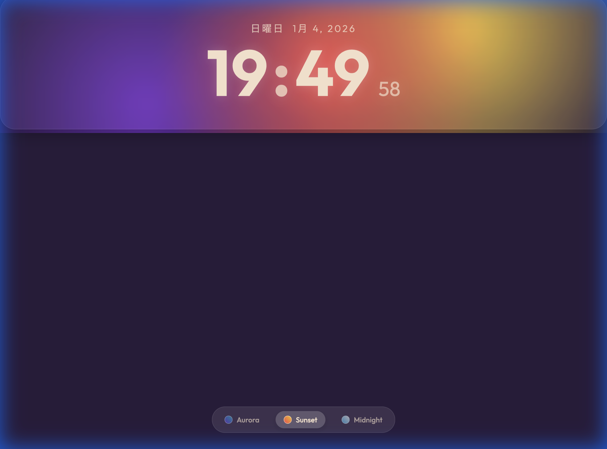
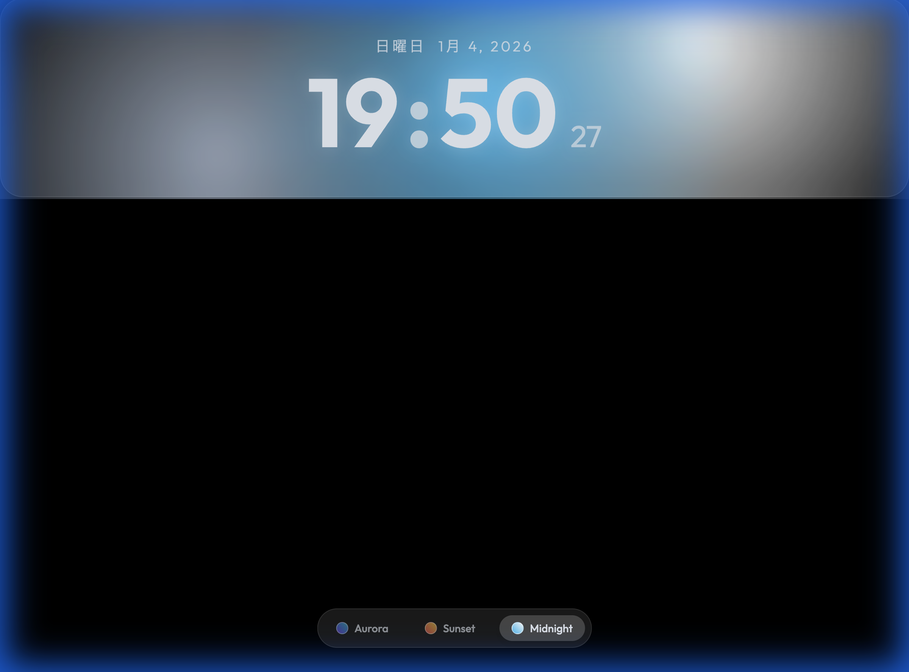

# Aurora Time ウォークスルー

## 主な機能

1.  **美しいビジュアル**: グラスモーフィズムを採用した透明感のあるUI。
2.  **3つのテーマ**: 気分に合わせて切り替えられるカラーパレット。
3.  **インタラクティブ背景**: マウスの動きに合わせて光が揺らぐパララックス効果。
4.  **没入モード**: 操作パネルは自動的に隠れ、フルスクリーンで時計だけに集中できます。

## スクリーンショット

### Aurora Theme

### Sunset Theme

### Midnight Theme

